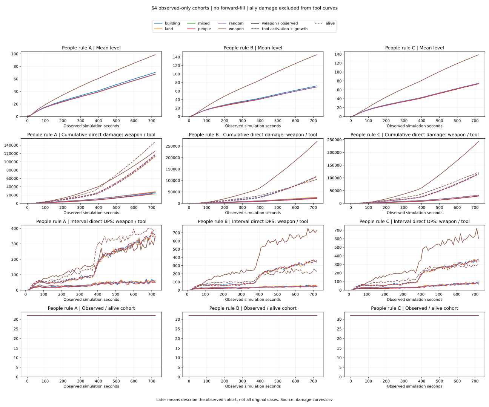

관문: 실패 — 독립 사례 576, 결정론 반복 1728, 모든 조건 공동 1위 포함 지배 정책 weapon, 리그 미작동 효과 0.

# S4 헤드리스 봇 리그

## 범위와 출처

모드 s4-stage. seed 목록 [42,43,44,45,46,47,48,49,50,51,52,53,54,55,56,57,58,59,60,61,62,63,64,65,66,67,68,69,70,71,72,73], 사람 규칙 A/B/C, 정책 weapon/land/building/people/mixed/random. 사례당 반복 3회는 같은 입력의 결정론 검사이며 독립 표본으로 세지 않는다. 관측 요청 21600틱 / 전체 설정 21600틱, tickRate 30. 광고 사용 0, 메타 neutral-no-meta. fixture-duration 생존은 전체 판 생존과 구분한다. 모든 수치의 입력은 보관된 raw/*.csv이며 요약 JSON이나 현재 콘텐츠 파일을 읽지 않는다.

| profileId | profileSha256 | contentSha256 | sourceCommit | sourceTreeSha256 | sourceDirty |
| --- | --- | --- | --- | --- | --- |
| core:s4_stage_one | C1CBD90906AB7416F547A6A888EFBFDF8B7B59D24D9461AAABDDCC4749DE75A6 | F3EFB782684164ADB91C4450725D1174B17CDCEA32304CD4630F3F07266A5144 | e4eb9d960e3f81522fd91c7a0ed5205694e3b9f8 | 0C311EF9AC26F1719DE462322005E07A85148208CE57A23726BB61B6EFF2E48C | false |

선택 집합은 실행 증거가 아니다. 선택 상세·조건·쿨타임·비용·측정 단위는 [metadata.csv](raw/metadata.csv)에 있다. 보관된 JSON 파일 SHA는 러너가 계산한 출처 기록이며 이 CSV 전용 재생성기가 JSON 원문을 재검증했다는 뜻은 아니다.

| file | sha256 | rows |
| --- | --- | --- |
| runs.csv | c2c82a1528ce220c057dddd923a1715f32c5cc02b6683d58b8acf97f2e55b77b | 576 |
| timeline.csv | e6f5623a28b61099de14ea6e815a5b829fe5ab586c299711b9ada00e12613990 | 42048 |
| cards.csv | d8ad5f532a9eb1f2f1b298c104334c428e20ce3e45093a32974032db6af80d97 | 45665 |
| loot.csv | a330c9b02e034de38289fcb34c89dd1392031af689ab0b60eb22ed7d4f74e36d | 13604 |
| effects.csv | 7a7a2d39be39d47acd71ede19d786ed594b197b6762b20baa9a302193a3579f8 | 14400 |
| determinism.csv | 93ccd3ef51632ca1ab0dd6eef5e356e1a4a1a4b3b799d24f698fe33ba305afd9 | 1728 |
| metadata.csv | aa6603975c66d651a11df0ad57f6806c1dfbb27dc94e9c2cadde913cab837826 | 50 |

## 생존·도달 시간·성장

| policy | peopleRule | n | survived | survivalRate | truncatedAlive | meanReachedSeconds | meanLevel | crossoverCases | medianCrossoverSeconds | medianCrossoverRunFraction | meanEstateRatio |
| --- | --- | --- | --- | --- | --- | --- | --- | --- | --- | --- | --- |
| weapon | A | 32 | 32 | 1 | 0 | 720 | 98.625000 | 30 | 40 | 0.055556 | 0.960816 |
| weapon | B | 32 | 32 | 1 | 0 | 720 | 145.375000 | 27 | 30 | 0.041667 | 0.957205 |
| weapon | C | 32 | 32 | 1 | 0 | 720 | 138.781250 | 27 | 30 | 0.041667 | 0.954159 |
| land | A | 32 | 32 | 1 | 0 | 720 | 67.375000 | 32 | 30 | 0.041667 | 0.996516 |
| land | B | 32 | 32 | 1 | 0 | 720 | 69.656250 | 32 | 30 | 0.041667 | 0.999368 |
| land | C | 32 | 32 | 1 | 0 | 720 | 73.781250 | 32 | 30 | 0.041667 | 0.997454 |
| building | A | 32 | 32 | 1 | 0 | 720 | 70.468750 | 32 | 30 | 0.041667 | 0.996580 |
| building | B | 32 | 32 | 1 | 0 | 720 | 72.187500 | 32 | 30 | 0.041667 | 0.998819 |
| building | C | 32 | 32 | 1 | 0 | 720 | 74.750000 | 32 | 30 | 0.041667 | 0.991926 |
| people | A | 32 | 32 | 1 | 0 | 720 | 67.718750 | 32 | 30 | 0.041667 | 0.994553 |
| people | B | 32 | 32 | 1 | 0 | 720 | 69.625000 | 32 | 30 | 0.041667 | 0.999473 |
| people | C | 32 | 32 | 1 | 0 | 720 | 73.375000 | 32 | 30 | 0.041667 | 0.996891 |
| mixed | A | 32 | 32 | 1 | 0 | 720 | 67.593750 | 32 | 30 | 0.041667 | 0.996823 |
| mixed | B | 32 | 32 | 1 | 0 | 720 | 69.656250 | 32 | 30 | 0.041667 | 0.999473 |
| mixed | C | 32 | 32 | 1 | 0 | 720 | 74.406250 | 32 | 30 | 0.041667 | 0.997329 |
| random | A | 32 | 32 | 1 | 0 | 720 | 67.593750 | 32 | 30 | 0.041667 | 0.996823 |
| random | B | 32 | 32 | 1 | 0 | 720 | 69.656250 | 32 | 30 | 0.041667 | 0.999473 |
| random | C | 32 | 32 | 1 | 0 | 720 | 74.406250 | 32 | 30 | 0.041667 | 0.997329 |

[전체 결과](outcomes.csv), [사례별 지표와 교차 상태](case-metrics.csv), [종료·사망 원인](death-causes.csv). 빈 사망 원인은 추측 없이 unknown으로 보존한다.

## 경험치 출처 분포

| policy | peopleRule | xpCases | meanKillShare | meanHarvestShare | meanTaxShare | harvestShareP25 | harvestShareP75 | pooledHarvestShare |
| --- | --- | --- | --- | --- | --- | --- | --- | --- |
| weapon | A | 32 | 0.597722 | 0.359906 | 0.042372 | 0.346255 | 0.374292 | 0.362906 |
| weapon | B | 32 | 0.384400 | 0.597394 | 0.018206 | 0.589764 | 0.632766 | 0.604164 |
| weapon | C | 32 | 0.408408 | 0.569061 | 0.022531 | 0.547041 | 0.606277 | 0.574065 |
| land | A | 32 | 0.666492 | 0.212415 | 0.121094 | 0.184513 | 0.236604 | 0.210479 |
| land | B | 32 | 0.630742 | 0.295464 | 0.073794 | 0.271340 | 0.329970 | 0.295820 |
| land | C | 32 | 0.574881 | 0.320350 | 0.104768 | 0.270955 | 0.373392 | 0.320586 |
| building | A | 32 | 0.608804 | 0.207700 | 0.183496 | 0.189380 | 0.221380 | 0.208189 |
| building | B | 32 | 0.587964 | 0.277481 | 0.134555 | 0.245517 | 0.301182 | 0.278332 |
| building | C | 32 | 0.557061 | 0.291056 | 0.151883 | 0.225522 | 0.349172 | 0.295454 |
| people | A | 32 | 0.653906 | 0.218440 | 0.127654 | 0.188425 | 0.262521 | 0.216378 |
| people | B | 32 | 0.621215 | 0.301407 | 0.077378 | 0.262429 | 0.340628 | 0.302884 |
| people | C | 32 | 0.571877 | 0.320908 | 0.107214 | 0.270057 | 0.366726 | 0.321234 |
| mixed | A | 32 | 0.658653 | 0.206620 | 0.134727 | 0.168973 | 0.244891 | 0.205370 |
| mixed | B | 32 | 0.630408 | 0.299926 | 0.069667 | 0.275220 | 0.325563 | 0.301015 |
| mixed | C | 32 | 0.567453 | 0.319129 | 0.113418 | 0.268364 | 0.363552 | 0.321307 |
| random | A | 32 | 0.658653 | 0.206620 | 0.134727 | 0.168973 | 0.244891 | 0.205370 |
| random | B | 32 | 0.630408 | 0.299926 | 0.069667 | 0.275220 | 0.325563 | 0.301015 |
| random | C | 32 | 0.567453 | 0.319129 | 0.113418 | 0.268364 | 0.363552 | 0.321307 |

평균 비율은 XP가 있는 각 사례의 비율을 평균한 값이고 pooledHarvestShare는 모든 XP를 합친 분모다. XP 합계가 없는 사례의 비율은 null이다. 분위수는 정렬값 사이 선형 보간이다. 경험치·식량을 피해로 환산하지 않는다.

## 시간 곡선과 교차

[실제 사례별 구간](case-timeline.csv), [관측 코호트 곡선](damage-curves.csv). 시각화는 별도 plot 단계에서 생성한다. 각 tick의 실제 관측 사례만 평균하며 nObserved/nAlive를 함께 표시한다. nAlive는 관측 시점의 영주 체력이 양수인 사례 수다. 사망·종료 뒤 값 채우기와 시간 보간은 없다. 이후 곡선은 살아남거나 더 오래 관측된 사례로 구성될 수 있어 최초 코호트 평균으로 해석하지 않는다.

도구 피해는 발동 피해+직접 성장 피해, 무기와 아군 피해는 별도다. 누적 교차는 두 피해가 모두 양수이고 도구가 무기 이상인 최초 관측 tick이며 동률도 포함한다. 첫 양수 관측에서 이미 우세한 경우 정확한 교차 순간을 알 수 없다. 구간 교차는 인접 관측의 피해 증가량으로 따로 계산한다. 교차 없음은 null, 교차 중앙값은 교차 사례만의 값이며 crossoverCases/n을 반드시 함께 본다. 샘플 간격 300틱보다 정밀한 시점을 주장하지 않는다. 교차의 전체 설정 길이 대비 비율도 기록한다. 설계 원본의 교차 시점은 다른 판 길이를 전제로 한 가설이므로 현재 설정에 그대로 적용하거나 비례 환산한 강제 합격선으로 삼지 않는다.

## 영지·선택·물품·효과

영지 체류는 영주 estateTicks/ticks이며 일꾼 체류가 아니다. [최종 장비·특허장 등급·물품 스택](final-builds.csv), [규칙별 최종 빌드 분포](build-distribution.csv), [카드 선택 분포](card-distribution.csv), [아이템 획득 채널](loot-distribution.csv), [도구별 실제 성장 대상](tool-growth.csv)를 분리했다. 물품은 카드가 아니며 슬롯 제한 없는 획득 스택이다. 카드 선택이 없는 사례 0개도 원래 분모에 남는다. 복수 성장 대상 카드는 mixed로 한 번만 센다.

| effectId | unit | activationCount | appliedTotal | activeCases | totalCases |
| --- | --- | --- | --- | --- | --- |
| core:boundary_hinge_guard | ticks | 82625 | 7728000 | 205 | 576 |
| core:guarded_harvest_strike | health-points | 173699 | 23489053 | 575 | 576 |
| core:guarded_harvest_tempo_cost | ticks | 661633 | 20216442 | 575 | 576 |
| core:harvest_scythe_harvest | plots | 157549 | 157549 | 576 | 576 |
| core:harvest_scythe_young_cost | growth-progress-units | 114474 | 15655709 | 576 | 576 |
| core:joiner_square_front | health-points | 62667 | -238392 | 244 | 576 |
| core:joiner_square_rear_cost | health-points | 47669 | 169244 | 281 | 576 |
| core:levy_bread_wrap_duty | ticks | 55623 | 11839920 | 372 | 576 |
| core:meadow_buckle_seed_guard | health-points | 1212 | 10408 | 233 | 576 |
| core:meal_oath_feed_workers | ticks | 402819 | 140970015 | 496 | 576 |
| core:muster_roll_rest | ticks | 1311011 | 164080260 | 251 | 576 |
| core:rally_boundary_rally | ticks | 898 | 116619 | 75 | 576 |
| core:repair_tithe_repair | health-points | 49318 | 1338351 | 327 | 576 |
| core:return_path_knot_waypoint | rerouted-groups | 28917 | 28917 | 119 | 576 |
| core:root_binding_cord_linked_delay | ticks | 9791 | 2072075 | 301 | 576 |
| core:root_binding_cord_shield | shield-charges | 20321 | 144471 | 491 | 576 |
| core:ruin_keystone_rebuild | health-points | 261 | 4152 | 76 | 576 |
| core:scaffold_step_draft_cost | position-units | 76047515 | -129947946 | 293 | 576 |
| core:scaffold_step_worker_speed | position-units | 28412814 | 49022539 | 219 | 576 |
| core:seed_pouch_lining_edge | position-units | 99873 | 9436146 | 537 | 576 |
| core:sheltered_sowing_shelter | shield-charges | 27991 | 155522 | 344 | 576 |
| core:shock_absorber_pad_knockback_cost | position-units | 223 | -3770 | 54 | 576 |
| core:shock_absorber_pad_repair | health-points | 3182 | 16804 | 168 | 576 |
| core:sowing_sworddance_line | plots | 2385 | 2385 | 452 | 576 |
| core:wind_seed_flag_inward | position-units | 306230 | 76287782 | 537 | 576 |

효과의 합계는 같은 effectId·같은 측정 단위 안에서만 계산한다. HP·틱·사람·변위 등을 하나의 영향 점수로 합산하지 않는다. 작동 횟수와 순변화는 별개이며 순변화가 상쇄되어도 작동할 수 있다. 리그에서 작동하지 않은 효과 0개는 **리그 실행 증거 없음**이다. 별도 Core 집중 테스트는 이 표본 수에 섞지 않는다.

## 지배 정책 판정

조건 96개에서 생존→도달 tick→레벨→총 전투 피해(무기+도구 발동+도구 성장+아군)의 사전 선언 순위로 비교했다. [조건별 공동 1위](rank-conditions.csv)의 모든 집합 교집합: weapon. 모든 조건에서 공동 1위여도 실패이며 전 정책 동률을 예외로 삼지 않는다. 식량·자재·체류율·메타 수출은 순위와 보상 점수에 넣지 않는다. 교집합이 비어도 이 표본에서 보편 지배가 없다는 의미일 뿐 전역 균형 증명이 아니다.

## 지배 정책 실패의 원인 가설

아래 수치는 [진단 집계](failure-observations.csv), [결과](outcomes.csv), [순위](rank-conditions.csv)에서 나온 관측이다. 원인 설명은 검증하지 않은 가설이며 현재 설정을 바꾸지 않았다.

- 생존·시간 포화: 전체 576개 중 생존 576개, 전체 설정 시간 도달 576개이며, 조건 96개 중 생존과 도달 시간이 전 정책에서 같은 조건은 96개다. **미검증 가설:** 현재 위협이 정책별 안전성 차이를 드러내기에 약할 수 있다. 위협만 달리하는 별도 통제 실험이 필요하며 현재 수치만으로 난도가 원인이라고 단정하지 않는다.
- 성장 순위와 경험치 환원: 교집합의 대표 정책 weapon가 다른 모든 정책보다 레벨이 엄격히 높은 조건은 96/96개다. 대표 정책 평균 레벨 127.593750, 나머지 사례 평균 70.816667; 평균 수확 XP는 각각 69827.968750, 10741.156250다. 생존·시간이 동률인 조건에서는 피해보다 레벨을 먼저 비교한다. **미검증 가설:** 이동·수확 도구·XP 환원의 상호작용이 성장 우위를 증폭했을 수 있다. 동일 이동 아래 카드 가중과 수확 도구를 분리하는 실험 전에는 무기 피해 자체의 보편적 우위로 해석하지 않는다.
- 비교 정책의 실질적 중복: 동일 사람 규칙·seed의 mixed/random 쌍 96개 중 카드 선택 원장 전체가 같은 쌍 96개, 관측 시간 원장 전체가 같은 쌍 96개다(caseId 제외). [진단 집계](failure-observations.csv), [카드 원자료](raw/cards.csv), [시간 원자료](raw/timeline.csv)에서 재계산한다. 별도 구현 검토에서는 현재 mixed의 범주별 가중이 서로 같아 random과 같은 정규화 선택 확률을 갖는 것을 확인했다. CSV의 일치는 이 실행의 관측 결과이며 가중 설정 자체의 증명은 아니다. 같은 곡선을 추가로 구별되는 전략의 증거로 세지 않는다. **미검증 가설:** 중립 비교 정책의 중복이 전략 탐색 범위를 좁혔을 수 있다. 구별되는 혼합 의사결정 규칙은 별도 실험으로 검토해야 하며, 현재 동작을 런타임 오류로 판단하거나 이번 실패를 없애려고 재조정하지 않는다.

## 재생성과 한계

`node tools/s4-report.mjs RAW_DIRECTORY OUTPUT_DIRECTORY --no-plots`는 보관된 CSV만으로 같은 표와 보고서를 재생성한다. 로컬 그림은 `python3 tools/s4-plot.py OUTPUT_DIRECTORY`로 생성한다. 생성 시각이나 현재 Git 상태를 결과에 주입하지 않는다.

선택 콘텐츠의 generic runtime projection과 실제 계측만 다룬다. 전체 후보 설명·그림·재미·모바일 판독성·첫 도구 설명 능력·사용자 기본 영지 선택·BM 적정성은 검증하지 않았다. 봇의 체류를 사람의 자발적 귀환 동기로 해석하지 않는다.

현재 정책은 카드 선택뿐 아니라 이동도 다르다. 무기형은 영지 주변 목표로 이동하고, 나머지 정책은 익은 밭이 있으면 그쪽을 우선한다. 따라서 수확·체류·생존 차이는 카드 가중만의 인과 효과가 아니라 이동을 포함한 봇 정책 전체의 차이다. 동일 이동으로 카드 가중만 바꾸는 통제 실험은 포함하지 않았다.

여기서 독립 사례는 반복을 제외한 고유 입력 조합 수다. 같은 seed를 정책과 사람 규칙 사이에 공유하므로 통계적으로 독립인 무작위 표본을 뜻하지 않는다. 최초 피해 교차 뒤 재역전할 수 있으며, 이 시점을 지속적인 도구 우세의 증거로 해석하지 않는다.
